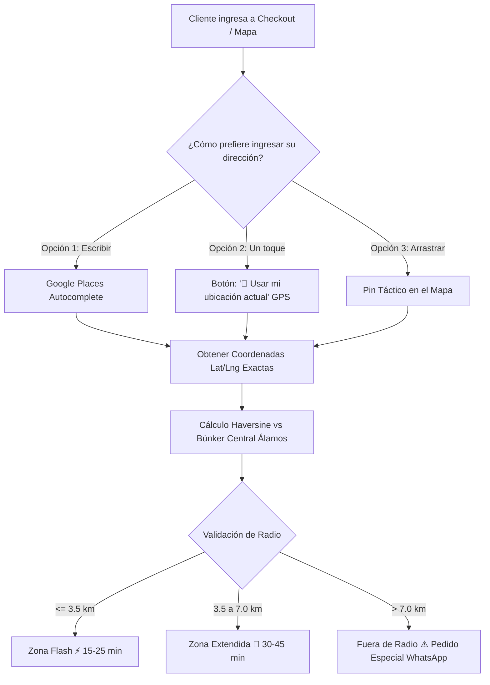

# 📋 Diverpremier: Plan Técnico y Auditoría del Sistema de Direcciones y Georreferenciación (Bogotá)

> **Fecha:** 4 de Septiembre, 2026  
> **Estado:** Auditoría completada · Arquitectura definida · Listo para implementación  
> **Objetivo:** Resolver con precisión milimétrica la búsqueda y ubicación de direcciones de entrega en Bogotá (especialmente Engativá, Fontibón y Álamos) para el checkout y el mapa táctico de Diverpremier.

---

## 1. Diagnóstico del Problema ("El Error Fantasma")

Al realizar pruebas en el mapa táctico ([`src/pages/mapa.astro`](file:///mnt/e069394d-1499-490f-8c02-e3d8d80039a1/Proyectos/Diverpremier/src/pages/mapa.astro)) buscando direcciones residenciales reales en Bogotá (ej. una casa en Álamos o Engativá), el sistema colocaba el pin en ubicaciones erróneas a más de 10 km de distancia (por ejemplo en Chapinero o Bosa).

### Causa Raíz Técnica
1. **Incompatibilidad de Modelo de Datos en OpenStreetMap (OSM):**  
   OpenStreetMap fue concebido bajo el estándar de numeración lineal anglosajón/europeo (*"123 Main Street"*). En Colombia, más del **95% de las placas prediales (`# 100-38`) no existen en la base comunitaria de OSM**.
2. **Nomenclatura Cartesiana vs. Números Lineales:**  
   En Bogotá, `Calle 71B # 100-38` no es un número de casa secuencial; describe una coordenada espacial relativa: *Vía principal Calle 71B, intersección con Carrera 100, y 38 metros hacia el siguiente cruce*. Nominatim no procesa este cálculo geométrico.
3. **Degradación Silenciosa:**  
   Nominatim descarta el conector `#` y los números posteriores al no hallar un nodo predial. Reduce la consulta a `Calle 71B, Bogotá` o `Calle 72, Bogotá` y devuelve el **primer tramo indexado** de la vía, habitualmente en Chapinero o Teusaquillo.
4. **Pruebas de Referencia Realizadas:**
   - Consulta `Calle 72 # 110-20` ➔ Rebotó a **Chapinero** (`4.6528, -74.0524`).
   - Consulta `Calle 80 # 100-10` ➔ Rebotó a **El Nogal** (`4.6638, -74.0532`).
   - Consulta `Carrera 100 # 71B-38` ➔ Rebotó a **Bosa / Cañaveralejo** (`4.6418, -74.1915`).

---

## 2. Evaluación de Infraestructuras Alternativas

| Infraestructura | Precisión en Bogotá | Disponibilidad / SLA | Costo Real | Veredicto |
| :--- | :--- | :--- | :--- | :--- |
| **A. IDECA / Catastro Bogotá** (`catastrobogota.gov.co`) | Milimétrica (lote predial) | ⚠️ **Inestable.** Requiere token privado (`code 499`). Caídas frecuentes fines de semana. | Gratuito bajo convenio | **Descartado:** No apto para e-commerce sin token gubernamental. |
| **B. Google Places Autocomplete** (Google Maps Platform) | **Exacta (Estándar Rappi / Pibox / Uber)** | 🟢 **99.99% SLA.** Soporta errores tipográficos y búsqueda en tiempo real. | **$0 USD** ($200 USD de crédito mensual gratis permanente de Google) | **RECOMENDADA (Ganadora indiscutible)** |
| **C. Motor Híbrido Local (Nominatim + Cuadrantes)** | Aproximada (nivel barrio) | 🟢 Alta (local) | Gratuito | **Útil como capa de respaldo secundaria (fallback).** |

### Hallazgo Clave sobre IDECA (Catastro Bogotá)
Durante las pruebas de auditoría mediante HTTP directo:
```json
// GET https://serviciosgis.catastrobogota.gov.co/arcgis/rest/services/geocodificador/Geocodificador/GeocodeServer/findAddressCandidates
{"error":{"code":499,"message":"Token Required","details":[]}}
```
La Alcaldía de Bogotá restringió los servicios abiertos al público anónimo, exigiendo tokens institucionales.

---

## 3. Arquitectura Recomendada (Patrón Pibox / Rappi)

Para lograr un sistema a prueba de fallos, implementaremos una **estrategia de tres capas sinérgicas**:



### Componentes:
1. **Google Places Autocomplete (Capa Primaria):**
   - El cliente empieza a escribir `cl 71b 100` y el sistema sugiere instantáneamente las direcciones oficiales de Bogotá.
   - Restringido con `componentRestrictions: { country: 'co' }` y sesgo (`locationBias`) centrado en Bogotá (`4.7026, -74.1174`).
2. **Geolocalización GPS Nativa (Capa Rápida):**
   - Botón *"🎯 Usar mi ubicación actual"*. Utiliza `navigator.geolocation.getCurrentPosition` con `enableHighAccuracy: true`.
   - Si el cliente está en su casa o en una fiesta, el GPS fija las coordenadas con un margen de 3 a 5 metros sin teclear una sola letra.
3. **Pin Táctico Arrastrable (Capa de Control):**
   - El cliente siempre puede arrastrar el pin si la portería o entrada de su conjunto/edificio queda sobre una calle diferente.

---

## 4. Viabilidad Financiera (Costo $0 USD)

* **Crédito Mensual de Google Cloud:** Google Maps Platform otorga automáticamente **$200.00 USD de crédito recurrente cada mes** a cada cuenta de facturación.
* **Consumo estimado:**
  * Cada sesión de *Places Autocomplete* cuesta aproximadamente $0.017 USD (utilizando Session Tokens).
  * $200 USD permiten entre **11.700 y 28.000 búsquedas de direcciones al mes de forma gratuita**.
* **Conclusión:** Para el volumen operativo de Diverpremier, el costo de la API es **$0.00 COP / mes**.

---

## 5. Hoja de Ruta de Implementación (Para Ejecutar Mañana)

### Fase 1: Credenciales y Seguridad (5 minutos)
1. Crear/abrir proyecto en Google Cloud Console.
2. Habilitar **Maps JavaScript API** y **Places API (New)**.
3. Crear API Key y restringirla por *HTTP Referrers*:
   - `localhost:4321/*` (Entorno de desarrollo local)
   - Dominio de producción (Vercel / dominio propio de Diverpremier).
4. Configurar la clave en el archivo `.env` del proyecto (`PUBLIC_GOOGLE_MAPS_API_KEY`).

### Fase 2: Actualización de [`src/pages/mapa.astro`](file:///mnt/e069394d-1499-490f-8c02-e3d8d80039a1/Proyectos/Diverpremier/src/pages/mapa.astro) (15 minutos)
1. Inyectar el script de carga asíncrona de Google Places en el encabezado.
2. Reemplazar la llamada a Nominatim por el widget de autocompletado enlazado al `input` de búsqueda.
3. Agregar el botón con icono táctico *"🎯 Usar mi ubicación actual"* junto a la barra de búsqueda.
4. Conectar el evento de selección para actualizar automáticamente:
   - Coordenadas de entrega del cliente.
   - Distancia exacta desde el Búnker Central (`Cl. 71B # 100-38`).
   - Insignia de zona (Flash vs Extendida) y tiempo de entrega.
   - Parámetros del enlace de WhatsApp.

### Fase 3: Homologación en el Checkout [`src/components/checkout/CheckoutForm.astro`](file:///mnt/e069394d-1499-490f-8c02-e3d8d80039a1/Proyectos/Diverpremier/src/components/checkout/CheckoutForm.astro) (10 minutos)
1. Replicar el autocompletado en el campo de dirección de entrega del formulario de pago.
2. Almacenar latitud y longitud en el pedido para pasarlas al despachador/repartidor.

### Fase 4: Pruebas de Calidad y Casos Borde (10 minutos)
1. Validar direcciones con sufijos (`Sur`, `Este`, letras `A`, `B`, `Bis`).
2. Validar conjuntos cerrados de Engativá y Álamos.
3. Validar cálculo de cobertura y enlace de WhatsApp generado.
4. `git add .`, `git commit` y despliegue.

---

> [!TIP]
> **Para iniciar mañana:** Cuando retomes la sesión, solo dime: *"Sergio, ya tengo la API Key"* o *"Empecemos primero con el botón de GPS nativo y luego agregamos la API Key"*, y ejecutaremos la fase correspondiente de inmediato.
