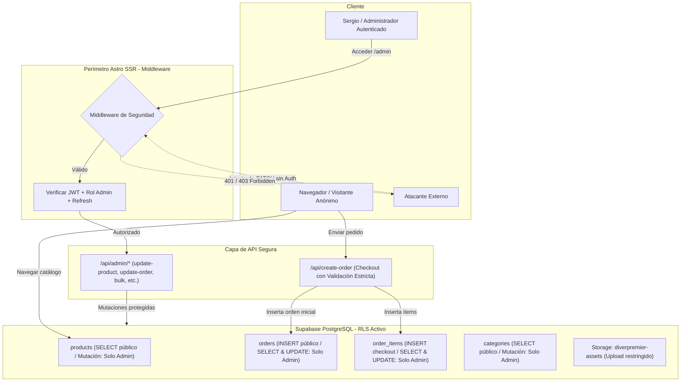

# Plan Maestro de Auditoría, Remediación y Blindaje RLS
**Proyecto:** Diverpremier Go  
**Módulo:** Dashboard Administrativo, APIs de Persistencia y Base de Datos (Supabase)  
**Fecha:** 9 de Septiembre, 2026  
**Estado:** Propuesto para ejecución

---

## 1. Resumen Ejecutivo y Diagnóstico

Tras una auditoría técnica profunda del repositorio y la base de datos de producción, se determinó que la seguridad del dashboard y la persistencia de datos presentan **vulnerabilidades críticas**. 

La arquitectura actual confía la seguridad únicamente en la protección visual de las rutas `/admin` en el navegador, mientras que:
1. Las APIs del servidor (`/api/*`) están completamente abiertas al internet público sin autenticación y operan con la `SUPABASE_SERVICE_ROLE_KEY` (bypass absoluto de RLS).
2. La tabla relacional de pedidos `order_items` **no tiene Row Level Security (RLS) habilitado**, permitiendo a cualquier cliente con la llave pública anónima leer, editar o borrar compras.
3. No existe control de acceso basado en roles (RBAC); cualquier cuenta autenticada tiene el mismo nivel de acceso.
4. El botón de cierre de sesión en la interfaz es un elemento visual inerte.

> [!CAUTION]
> **Riesgo Inmediato**: Un usuario malintencionado que examine las peticiones de red puede alterar precios de venta, vaciar el stock de productos, auto-aprobar pagos de pedidos o borrar el contenido de las compras sin requerir credenciales de administrador.

---

## 2. Matriz de Hallazgos y Severidad

| ID | Componente Afectado | Vulnerabilidad / Debilidad | Vector de Ataque | Severidad |
| :--- | :--- | :--- | :--- | :---: |
| **SEC-01** | Tabla `order_items` | RLS desactivado en PostgreSQL | Consulta y mutación directa vía Supabase SDK con `anon_key` | **CRÍTICA** |
| **SEC-02** | Endpoints `/api/update-product` y `/api/update-order` | Sin validación de sesión + Uso de Service Role Key | Peticiones HTTP `PATCH` sin autenticar desde Postman/cURL | **CRÍTICA** |
| **SEC-03** | Endpoints `/api/bulk-products` y `/api/bulk-upload-images` | Carga masiva sin control de acceso | Peticiones HTTP `POST` alterando catálogo y storage | **ALTA** |
| **SEC-04** | Middleware (`src/middleware.ts`) | Solo intercepta `/admin*`, excluyendo `/api/*` | Omisión perimetral de peticiones de backend | **ALTA** |
| **SEC-05** | Supabase Auth / RBAC | Sin verificación de rol administrativo (`admin`) | Cualquier cuenta de Supabase con sesión válida accede a `/admin` | **ALTA** |
| **SEC-06** | Sesión en Middleware | Inexistencia de token refresh automático | Expulsión forzosa del admin al expirar el JWT (1 hora) | **MEDIA** |
| **SEC-07** | `AdminLayout.astro` | Botón de cerrar sesión desconectado | Sesión huérfana en cookies del navegador | **BAJA** |

---

## 3. Arquitectura de Seguridad Objetivo



---

## 4. Hoja de Ruta de Remediación (Paso a Paso)

### Fase 1: Blindaje en Base de Datos (SQL Migrations)
1. **Activar RLS en todas las tablas desprotegidas:**
   ```sql
   ALTER TABLE order_items ENABLE ROW LEVEL SECURITY;
   ALTER TABLE orders ENABLE ROW LEVEL SECURITY;
   ```
2. **Definir Políticas Estrictas de Pedidos:**
   - `orders`:
     - `SELECT`: Solo administradores autenticados (`auth.uid() IN (SELECT user_id FROM admin_users)` o `auth.jwt() ->> 'role' = 'admin'`).
     - `INSERT`: Permitido para creación de pedidos públicos con estados restringidos únicamente a `pending_payment`.
     - `UPDATE`: Exclusivo para administradores.
   - `order_items`:
     - `SELECT`: Exclusivo para administradores.
     - `INSERT`: Permitido durante el checkout.
     - `UPDATE` / `DELETE`: Exclusivo para administradores.
3. **Definir Políticas Estrictas de Catálogo:**
   - `products` y `categories`:
     - `SELECT`: Público (`USING (true)`).
     - `INSERT`, `UPDATE`, `DELETE`: Exclusivo para administradores.

### Fase 2: Blindaje del Middleware (`src/middleware.ts`)
1. **Extender el filtro perimetral:** Interceptar tanto `/admin/*` como todas las rutas mutativas `/api/*` que correspondan a operaciones administrativas:
   - `/api/update-product`
   - `/api/update-order`
   - `/api/bulk-products`
   - `/api/bulk-upload-images`
   - `/api/upload-image`
2. **Validación de Rol Administrativo:** Verificar que el usuario no solo exista, sino que posea credenciales de administrador (ej. correo autorizado en variable de entorno o metadata de rol).
3. **Implementación de Token Refresh Automático:** Si `getUser(accessToken)` retorna error por expiración pero existe `sb-refresh-token`, invocar `supabase.auth.refreshSession` y renovar las cookies de respuesta de forma transparente sin expulsar al administrador.

### Fase 3: Endurecimiento de Endpoints API
1. **Validación de Payloads:** Comprobar tipos de datos, rangos y valores obligatorios antes de realizar cualquier operación en base de datos.
2. **Eliminación de la Service Role Key para operaciones de cliente:** Usar el cliente autenticado del usuario siempre que sea posible, reservando la Service Role Key exclusivamente para tareas que requieran elevar privilegios justificadamente (ej. ejecución de triggers internos).
3. **Manejo Seguro de Errores:** Evitar enviar detalles crudos de PostgreSQL (`details: error.message`) en las respuestas HTTP de error hacia el cliente.

### Fase 4: Experiencia de Usuario y Cierre de Sesión
1. **Creación del endpoint `/api/auth/logout`:**
   - Limpiar cookies `sb-access-token` y `sb-refresh-token`.
   - Ejecutar `supabase.auth.signOut()`.
   - Responder con redirección a `/login`.
2. **Conexión en `AdminLayout.astro`:**
   - Asignar ID al botón de salida.
   - Agregar listener de evento para confirmación y cierre de sesión inmediato.

---

## 5. Checklist de Verificación y Pruebas Post-Implementación

- [ ] **Prueba 1 (Anon Read Items):** Intentar consultar `order_items` con `anon_key` $\rightarrow$ Debe retornar `0` filas o denegado.
- [ ] **Prueba 2 (Anon Update Items):** Intentar modificar cantidad de `order_items` con `anon_key` $\rightarrow$ Debe arrojar error `42501 (violates row-level security)`.
- [ ] **Prueba 3 (Anon Update Product):** Enviar `PATCH /api/update-product` sin cookies de sesión $\rightarrow$ Debe responder `401 Unauthorized`.
- [ ] **Prueba 4 (Anon Update Order):** Enviar `PATCH /api/update-order` sin cookies de sesión $\rightarrow$ Debe responder `401 Unauthorized`.
- [ ] **Prueba 5 (Admin Flow):** Iniciar sesión en `/login`, ingresar a `/admin/inventario` y modificar precio/stock $\rightarrow$ Debe sincronizar exitosamente con status `200`.
- [ ] **Prueba 6 (Admin Orders Flow):** Cambiar estado de orden a `verified` desde `/admin/pedidos` $\rightarrow$ Debe actualizar estado y descontar stock correctamente con sesión activa.
- [ ] **Prueba 7 (Logout):** Hacer clic en el botón de salida del sidebar $\rightarrow$ Debe borrar cookies y redirigir limpiamente a `/login`.
- [ ] **Prueba 8 (Token Expiry):** Dejar la sesión inactiva más de 60 minutos $\rightarrow$ El middleware debe refrescar automáticamente el token sin romper la navegación.
